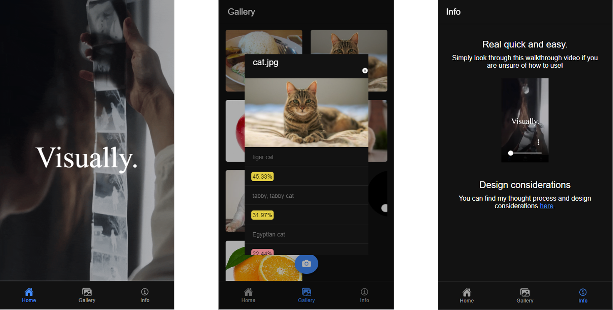

 [Ionic Angular](https://ionicframework.com/docs/angular/overview) (web app) and [Capacitor](https://capacitor.ionicframework.com) (native app runtime).

# Visually

**Visually** is a hybrid app (mobile and web) to allow user to process uploaded image to show the the classifications involved. Visually is built with Ionic, Angular, Firebase and Node. Main libraries include Tensorflowjs to incorporate machine learning models. Do refer to the below sections for more details.

## Feature Overview
* Tensorflowjs is used the main pre-trained model for image classification
* Users can upload or capture photos to check the classification types

## How to Run

0) Install Ionic if needed: `npm install -g @ionic/cli`.
1) Clone this repository.
2) In a terminal, change directory into the repo: `cd visually`.
3) Install all packages: `npm install`.
4) Run on the web: `ionic serve`.
5) Run on web on the hosted platform [here](https://visually-84fb9.web.app/)

### Timeline
Time for roll out v1.0 is estimated to be 1.5 days (from 14 Nov night to 16 Nov noon).

## Tech Stack Consideration
Considerations include React Native, Flutter and Ionic. I decided to go with Ionic because I am more familiar with Angular but it is my first time with Ionic. The main considerations for computer visions include OpenCV and Tensorflowjs libraries. OpenCV is a full fledged computer vision library while Tensorflow focuses on Machine learning models. In this case, the Tensorflowjs packages are used. In particular, pre-trained models in MobileNet were used, together with its additional backend CPU and WebGL.

## Revision Control
Separate branches were used for configurations of the features, UI enhancements , improving code quality, etc. They are subsequently merged with the `develop` branch. Once `develop` branch is been through testing and ready for release, it will be merged to the `main` branch for stable production. Forking of repo was not used because this is individual project.

## Challenges faced
* Significance difference as compared to web-app. When it comes to libraries used there is a need to also consider cross-platform versatility. Some packages only supports one OS.
* Ionic framework is quite different. The building of UI components for **both** the view (ionic elements) and controllers are very different. The steps required are generally more. At the same time, this is to also ensure cross-platform fit such that properties of the same element can be recognized in different OS, whereas regular Angular framework is only for web view. In overall, this was a really interesting experience.
* CORS policy and the handling of HTTP requests while building the cloud APIs. This will be elaborated below.

### CORS policy
* With the existing mechanism to restrict cross-origin HTTP requests from client scripts. There is a need to allow CORS HTTP end point authentication to prove that the Visually client is not malicious.
* A couple of hours was spent trying to download the relevant packages and write the APIs for Firebase Cloud functions to deploy the frameworks but due to complications and bugs, it was not completed. In particular, CORS was configured, and the HTTP response do contain the intended data but returns as error. Given the time constraints, I decided in the move on with the image upload and UI.

## UI SCSS, format: design consideration
* Similarly, to allow cross-platform suitability, different set of styles are applied across the different OS.
* To ensure more consistency with CSS (SCSS) styling across devices, I used 'px' for borders and 'em'/'rem' for payout positioning
* UI components and elements such as modals and upload image file button had to be refactored when tested on my phone because it did not work initially.
